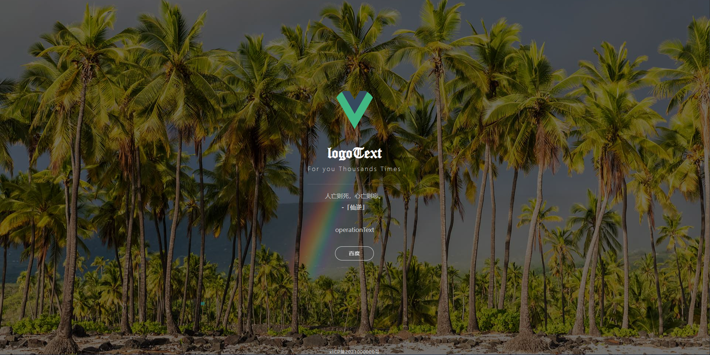

# 一个博客前置的 导航/中转 模板
## 使用vue3 + vite4 + ts重构
## framework-navigation

### 忘记借用的谁的了，之前那个是纯html和css写的，如果知道原作者我会补一下感谢
### 开箱即用，简单动画，具体数据见config配置
### 功能: 
- 每日一言
- 必应壁纸
- 按钮跳转
- 底部备案号配置

## 图：

### 有问题欢迎提issue
